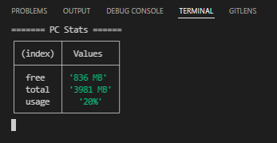

# MemoryStats-Nodejs

Simple Node.js application that monitors memory usage and displays system statistics in real time.

## Features

- Displays free memory
- Displays total memory
- Calculates memory usage percentage
- Updates information every second

## Technologies

- JavaScript
- Node.js
- OS Module

## Example Output

## Author

Jorge Eduardo Rodrigues
